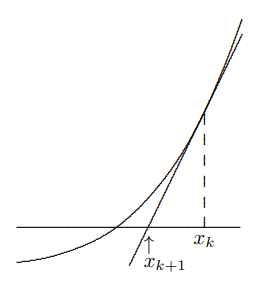
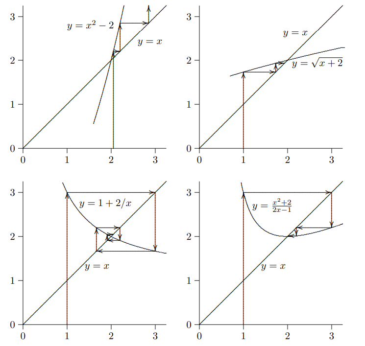

```
---
Name: Hanson Jiang
Topic: 19
Title: Fixed point iteration method and Newton's method
---
```
# Fixed point iteration method and Newton's method

## Table of Contents


* [History and Analysis](#History-and-Analysis)
	* [Fixed-Point](#fixed-point)
	* [Fixed-Point Example](#fixed-point-example)
	* [Newton](#newton)
	* [Newton's Method Example](#newtons-method-example)
* [Reasons for failure](#Reasons-for-failure)
	* [Fixed-Point Iteration Failures](#fixed-point-iteration-failures)
	* [Newton's Method Failures](#Newtons-Method-failures)
		* [Edge Case](#edge-case)
* [Special Case of Newton's Method](#Special-Case-of-Newtons-method)
    * [Babylonian Method Example](#Babylonian-method-example)
* [Pseudocode](#Pseudocode)
    * [Fixed-Point Iteration Method](#Fixed-Point-Iteration-Method)
    * [Newton's Method](#Newtons-Method)
* [References](#References)
## History and Analysis
### Fixed-Point
The fixed-point iteration method is used to find solutions for f(x) = 0. By rewriting f(x) in such a way to define a function g such that x = g(x), we have "a fixed point of the function g, since x is unchanged when g is applied to it" (Heath, 2009, p.225).

### Fixed-Point Example
For some function $f(x)=x^2-3x-4$ with roots 4 and -1, we can rewrite this for fixed-point functions such as
$$g(x) = \frac{x^2-4}{3}$$

$$g(x) = \frac{4}{x-3}$$

where g(x) = x. The iteration scheme for fixed-point is as followed:
$$x_{k+1} = g(x_k)$$
with initial guess $x_0$.

An example workthrough of fixed-point iteration method using the functions above is as followed:
$$f(x)= x^2-3x-4$$
$$g(x)= \frac{4}{x-3}$$
$$x_0 = 2$$
Then we have that
$$x_1 = g(x_0) = \frac{4}{2-3} = -4$$
$$x_2 = g(x_1) = \frac{4}{-4-3} = -0.571$$
$$x_3 = g(x_2) = \frac{4}{-0.571-3} = -1.12$$
$$x_4 = g(x_3) = \frac{4}{-1.12-3} = -0.971$$
$$x_5 = g(x_4) = \frac{4}{-0.971-3} = -1.007$$
$$x_6 = g(x_5) = \frac{4}{-1.007-3} = -0.998$$
$$x_7 = g(x_6) = \frac{4}{-0.998-3} = -1.000$$
where we can approximate from fixed-point iteration that one of the roots to f(x) is -1.

### Newton
Newton's method further elaborates on fixed-point method by providing a more educated guess to use for g(x) in our iteration scheme. This method was [first seen](https://en.wikipedia.org/wiki/De_analysi_per_aequationes_numero_terminorum_infinitas) back in 1711 from Isaac Newton. We are "approximating the function $f$ near $x_k$ by the tangent line at $f(x_k)$" (Heath, 2009, p.228).



where the iteration scheme for Newton's method is $x_{k+1} = g(x) = x_k - f(x_k)/f'(x_k)$.

It should be noted that if the root has [multiplicity](https://www.mathwords.com/m/multiplicity.htm) greater than 1, Newton's method is linearly convergent and not ncessarily a faster way of approximating the root.
### Newton's Method Example
Newton's method follows basically the same steps as a fixed-point iteration method one would, but using $g(x) = x_k - f(x_k)/f'(x_k)$.

Perform a few iterations of Newton's method to find the roots of $f(x) = x - e^{-x}$ using initial guess $x_0 = 1/3$.
$$f'(x) = 1 + e^{-x}$$
$$x_{k+1} = x_k - f(x_k)/f'(x_k)$$
$$x_1 = x_0 - f(x_0)/f'(x_0) = \frac{1}{3} - f(\frac{1}{3})/f'(\frac{1}{3}) = 0.556573$$
$$x_2 = x_1 - f(x_1)/f'(x_1) = 0.556573 - f(0.556573)/f'(0.556573) = 0.567123$$
$$x_3 = x_2 - f(x_2)/f'(x_2) = 0.567123 - f(0.567123)/f'(0.567123) = 0.567143$$
$$x_4 = x_3 - f(x_3)/f'(x_3) = 0.567143 - f(0.567143)/f'(0.567143) = 0.567150$$
We can continue iterating until we reach the desired number of decimal places of precision, but for the sake of example, this should be enough. Thus we can say that a root of $f(x)$ is $\approx 0.567150$.
## Reasons for failure
However, these algorithms and methods are not perfect and can fail for any multidude of reasons.
### Fixed-Point Iteration Failures
"The behavior of fixed-point iteration schemes can vary widely, from divergence, to slow convergence, to rapid convergence" (Heath, 2009, p.226). This means that depending on the g(x) function used, fixed-point iteration method may not actually converge.



As can be seen from the figure above (Heath, 2009, p.227), the top left function diverges, as each iteration takes it further away from the root. Whereas, for the other 3 functions, they do converge, but at varying speeds.

For root solution $r$, if $r = g(r)$ and $|g'(r)| < 1$, we can say that the iterations are locally convergent. However, if $|g'(r)| > 1$, then the iterations will diverge if you don't guess it correctly on the first try.

Looking back at [our example from earlier](#fixed-point-example), let's consider g(x) and evaluate the derivative at the root 4 and -1. 
$$g(x) = \frac{4}{x-3}$$
$$g'(x) = \frac{-4}{(x-3)^2}$$
$$g'(4) = \frac{-4}{1} = -4$$
$$|-4| > 1$$
$$g'(-1) = \frac{-4}{16} = \frac{-1}{4}$$
$$|\frac{-1}{4}| < 1$$
So fixed-point iteration will diverge if we are looking for root 4, but will locally converge when looking for root -1. 

Ideally, we would like a faster convergence, such that $g'(x) = 0$ so that the convergence rate is quadratic, and not linear. However, a constant such as $\frac{-1}{4}$ will still locally converge as shown in the example.
### Newton's Method Failures
Although Newton's method can usually converge more quickly than fixed-point iteration method would, there are limitations and conditions that can cause the method to fail.
* If the derivative of f(x) is evaluated as 0, meaning a stationary point, then the method will fail as it is not possible to divide by zero.
* If the derivative of f(x) does not exist or is discontinuous at the root, Newton's method will fail.
* If the initial guess is too far away from the actual root, Newton's method may not converge. To determine if this will be the case, it is the same process as used to check divergence in [fixed point methods](#fixed-point-iteration-failures) but with $g(x) = x - f(x)/f'(x)$.
* For some functions, using certain starting points results in an [edge case](#edge-case) where it may enter an infinite cycle.
#### Edge Case
Suppose we have $f(x) = x^3 - 2x + 2$ and $f'(x) = 3x^2 - 2$.

If we are to perform Newton's method, starting with $x_0=0$ as our initial guess, we get:

$$x_{k+1} = x_k - f(x_k)/f'(x_k)$$

$$x_1 = x_0 - f(x_0)/f'(x_0) = 1$$

$$x_2 = x_1 - f(x_1)/f'(x_1) = 0$$

$$x_3 = x_2 - f(x_2)/f'(x_2) = 1$$

$$x_4 = x_3 - f(x_3)/f'(x_3) = 0$$

where the iterations enter a cycle, looping between 0 and 1 infinitely without reaching a better approximation.
## Special Case of Newton's Method
A special case of Newton's method to compute square roots is the Babylonian method, 
which was used as far back as the ancient Greek times. To approximate some value $\sqrt{S}$, if 
x is an overestimate, then $\frac{S}{x}$ would be an underestimate. The rationale was that the average of 
these two values, $\frac{1}{2}(x + \frac{S}{x})$, could be better for the $\sqrt{S}$ approximation (Fowler & Robson, 1998). With enough iterations, the approximation would 
converge to an accurate square root value.

This "average of the two values" can be equivalently deduced by employing Newton's method and solving for the roots of the function $f(x) = x^2 - S$. Newton's method can be viewed as a version of fixed-point iteration method $x = g(x)$ where $g(x)$ is defined as $g(x) = x - \frac{f(x)}{f'(x)}$ for approximation (Heath, 2009, p.229). Thus: 
$$g(x) = x - \frac{x^2 - S}{2x}$$
$$= \frac{2x^2}{2x} - \frac{x^2-S}{2x} $$
$$= \frac{1}{2}(\frac{x^2+S}{x})$$
$$= \frac{1}{2}(x + \frac{S}{x})$$
### Babylonian Method Example
Compute/approximate $\sqrt{S}$ for $S=335$. Let initial guess $x_0=20$.
To perform Babylonian method we have $f(x)=x^2 - S$ and $g(x)=\frac{1}{2}(x + \frac{S}{x})$.

$$x_{k+1} = g(x_k) = \frac{1}{2}(x_k + \frac{S}{x_k})$$

$$x_1 = \frac{1}{2}(x_0 + \frac{S}{x_0}) = \frac{1}{2}(20 + \frac{335}{20}) = 18.375$$

$$x_2 = \frac{1}{2}(x_1 + \frac{S}{x_1}) = \frac{1}{2}(18.375 + \frac{335}{18.375}) = 18.303$$

$$x_3 = \frac{1}{2}(x_2 + \frac{S}{x_2}) = \frac{1}{2}(18.303 + \frac{335}{18.303}) = 18.303$$
For the sake of our example, 3 decimals of precision is enough. Thus we can approximate that $\sqrt{335} \approx 18.303$.
## Pseudocode
Below is pseudocode for the fixed-point iteration and Newton's method algorithms.
### Fixed-Point Iteration Method
```
1. Define f(x) from given function f(x) = 0
2. Define g(x) by converting f(x) into form x = g(x)
3. Define counter as count = 1
4. INPUT:
    x0 as initial guess
    max_iterations as maximum number of iterations
    tolerance as tolerance to stop iterations
5. for (k in max_iterations)
	x1 = g(x0)
	count = count + 1

	if count > max_iterations
	    print "Did not converge"
	    return None 

	if |x1 - x0| < tolerance
	    return x1

	x0 = x1

6. Print x1 for final result	
```
### Newton's Method
```
1. Define f(x) whose root we are looking for
2. Define fprime(x) as the derivative of f(x)
3. Define counter as count = 1
4. INPUT:
    x0 as initial guess
    max_iterations as maximum number of iterations
    tolerance as tolerance to stop iterations
5. for (k in max_iterations)
	y = f(x0)
	yprime = fprime(x0)
	count = count + 1

	if yprime == 0
	    print "Divide by zero error"
	    return None

	if count > max_iterations
	    print "Did not converge"
	    return None

	x1 = x0 - y/yprime

	if |x1 - x0| < tolerance
	    return x1

	x0 = x1

6. Print x1 for final result
```


## References

1. Fowler, D., & Robson, E. (1998). Square Root Approximations in Old Babylonian Mathematics: YBC 7289 in Context. https://doi.org/10.1006%2Fhmat.1998.2209
2. Heath, M. T. (2009). Scientific Computing: An Introductory Survey (pp. 215-254). McGraw Hill. 
